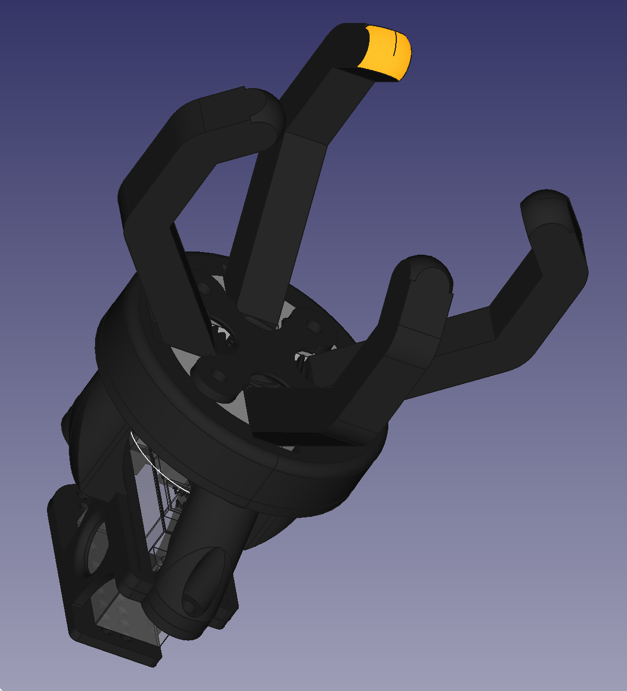
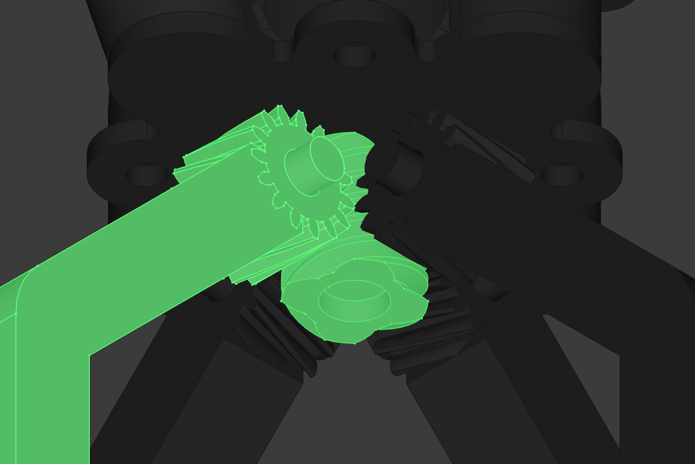
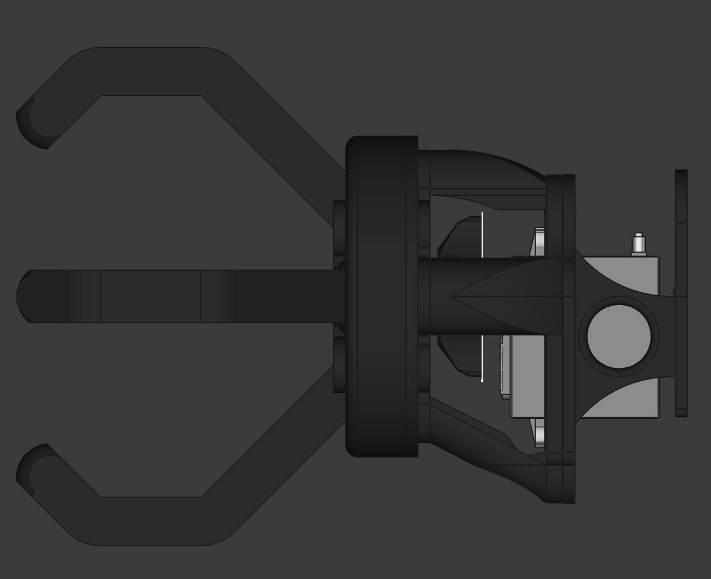
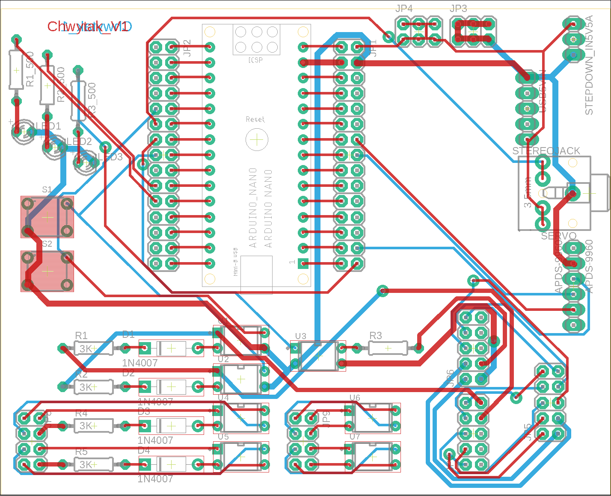
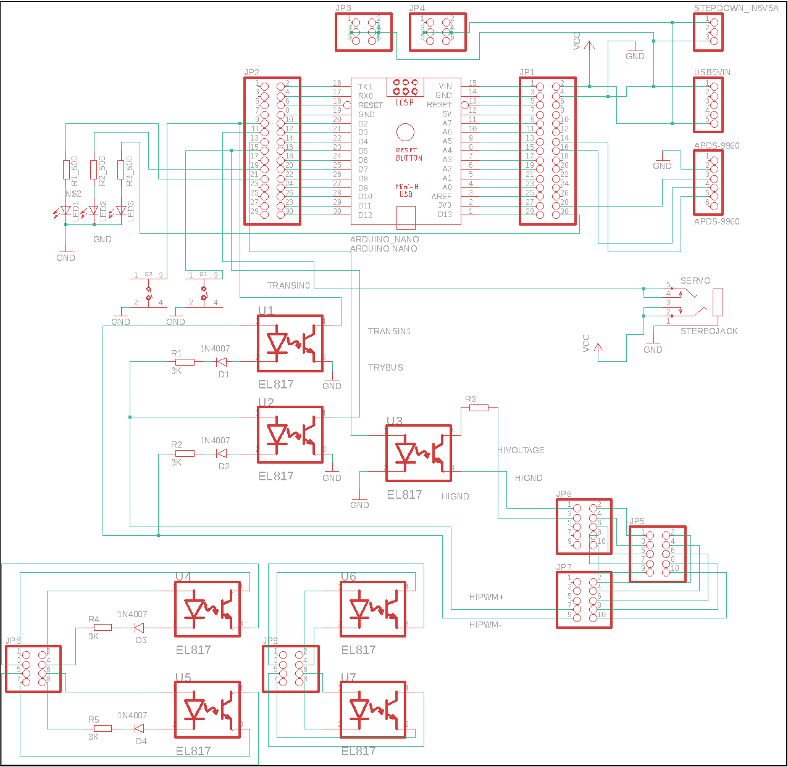

# Servo-Based Gripping Mechanism with Light Sensor Control, CAD, and PCB Design

## Overview: CAD Design

The gripper features a worm gear coupled with a servo mechanism, converting rotational torque into a synchronised gripping action via four geared arms. A worm gear was chosen for its self-locking properties, ensuring that when the servo loses power, the gripper remains locked in place.

The parts were specifically designed and optimised for 3D printing, allowing for efficient fabrication. The entire mechanism is assembled using four screws, though some components require superglue to secure the servo mount properly.

## Overview: PCB Design

The PCB is built around an AVR microcontroller, specifically an Arduino Nano (off-brand AVR to reduce costs). It includes:

- Expansion pins for future modifications.
- LED indicators to display the microcontroller’s status.
- Manual operation buttons for direct control.
- An opto-electronic couplers for secure signal exchange with a higher voltage system.

The board supports 5V and 12V power lines, along with high-current traces for driving the servo.

---
