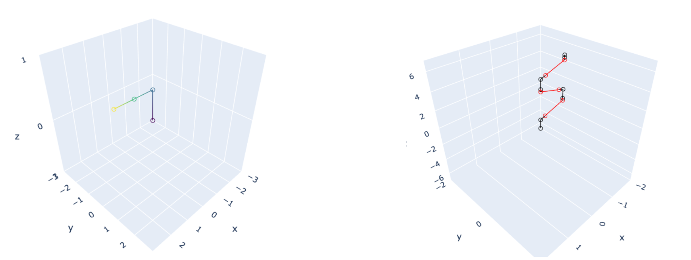
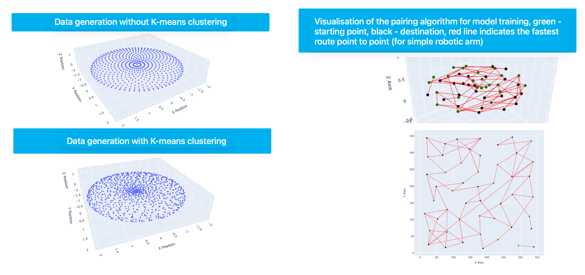
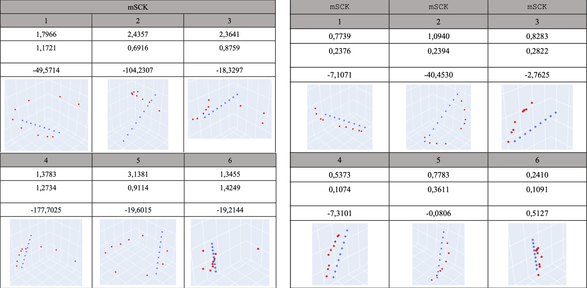

# About this project

The project explores the direct application of neural networks for solving inverse kinematics in two robotic arm configurations: a simple two-joint arm and a more complex seven-joint arm. I employed a self-supervised learning (SSL) technique and compared its performance to supervised learning. By leveraging the SSL approach, I successfully implemented a recursive refinement algorithm to enhance prediction accuracy. The final results were promising but indicate the need for further research to fully realise their potential.

### Data Generation
The "Generator" Jupyter Notebook involves a comprehensive analysis of vector pairing, clustering, transformation, and visualization. Here are the key highlights:

- Vector Pairing and Optimization: The notebook contains algorithms to pair vectors based on proximity, employing Euclidean distance and KDTree for efficient neighbor searches, with iterative refinement of pairing constraints.

- Dimensionality Reduction: The implementation of PCA and UMAP reduces vector dimensions to aid in clustering and visualization.

- Clustering Techniques: The KMeans algorithm is used to group vectors into clusters, serving as a basis for further operations like pairing and transformations.

- Vector Generation and Transformation: Functions generate random vectors with constraints like bounds, precision, and step sizes. Further transformations include random perturbations and scaling within specified ranges.

- Distance Metrics: Several functions calculate distance statistics, including mean, minimum, and maximum distances, as part of iterative pairing processes.

- Angle Encoding and Decoding: Angles in vector data are encoded into sine and cosine values for use in models, and functions to decode them back into degrees are included.

- 3D Visualization: Plotly's interactive 3D visualizations display paired vectors in space, showcasing connections and distributions of data points.

- Iterative Refinement: An iterative process for refining pairings based on statistical metrics like average distance ensures better distribution and adherence to constraints.

- Data Export and Saving: The processed and encoded data is saved as .npy files for downstream tasks, ensuring reproducibility.

- Cluster and Pair Visualization: Final cluster results and pairings are visualized through scatter plots and 3D plots, helping in interpreting relationships within the data.

### Model Training and Evaluation
The "Training" notebook involves advanced neural network training and robotic arm simulation. Here are its key aspects:

Description of the captions in the tables, from top to bottom: The **LEFT table** represents results without recursive optimisation, while the **RIGHT table** includes results with optimisation. Integer numbers indicate paths (blue: expected, red: predicted by the model). The first floating-point number represents the average MAE, the second represents the standard deviation, and the third indicates the R² score.

- Neural Network Architectures: The notebook implements various neural networks, including dense, convolutional, and GRU-based architectures, for different tasks related to angle prediction and robotic control.

- Model Training: Networks are trained using datasets of features and labels with optimizers like Adam and Nadam, focusing on loss metrics such as mean absolute error (MAE) and mean squared error (MSE).

- Robotics Simulation: Functions predict and evaluate robot joint angles and resulting end-effector positions using inverse kinematics, aiding robotic arm simulations.

- 3D Visualization: Plotly visualizations include 3D scatter plots to compare predicted and actual joint positions, with tools for inspecting performance visually.

- Iterative Improvement: Methods include perturbations of input configurations to iteratively improve predictions, incorporating optimization logic with constraints.

- Complex and Parallel Models: The notebook explores complex models combining dense layers, convolutional layers, and parallel branches, highlighting modular architecture experimentation.

- Evaluation Metrics: Evaluations include R², adjusted R², RMSE, and MAE. These metrics help validate model accuracy and robustness for robotic applications.

- Data Preprocessing: Techniques such as normalization and angle encoding (using sine and cosine) prepare data for better network performance.

- Custom Loss Functions: The implementation of a DistanceLoss function emphasizes application-specific optimization, likely tailored to robotic arm control.

- Model Deployment: Trained models are saved and reloaded for predictions, demonstrating deployment-readiness and reproducibility.

---
